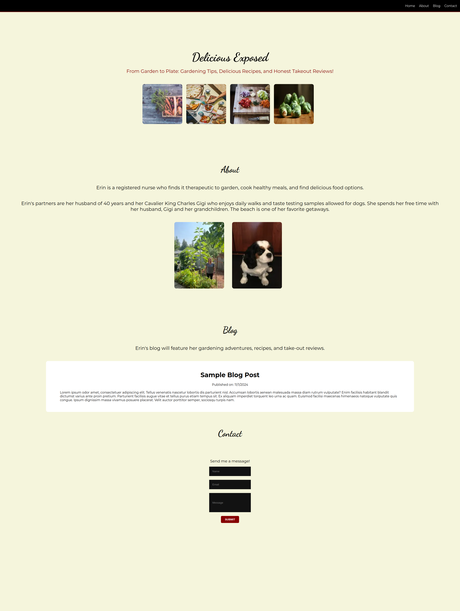

# food-blog

From Garden to Plate: Gardening Tips, Delicious Recipes, and Honest Takeout Reviews!



## Table of Contents
1. [Introduction](#introduction)
2. [Features](#features)
3. [Installation](#installation)
4. [Usage](#usage)
5. [Technologies Used](#technologies-used)
6. [Citations](#citations)
7. [License](#license)

## Introduction
A React / NextJS blog project for foodies.

## Features
- An about section highlighting the author
- A Sanity CMS blog for gardening tips, take out reviews, and recipes
- A contanct form using EmailJS

## Installation
1. Clone the repository:
   ```sh
   git clone https://github.com/your-username/food-blog.git

Citations: 

Photo by <a href="https://unsplash.com/@krstne?utm_content=creditCopyText&utm_medium=referral&utm_source=unsplash">Kristine Tumanyan</a> on <a href="https://unsplash.com/photos/sliced-vegetables-on-brown-wooden-chopping-board-YmgpoBhJAkI?utm_content=creditCopyText&utm_medium=referral&utm_source=unsplash">Unsplash</a>

Photo by <a href="https://unsplash.com/@glenncarstenspeters?utm_content=creditCopyText&utm_medium=referral&utm_source=unsplash">Glenn Carstens-Peters</a> on <a href="https://unsplash.com/photos/person-using-macbook-pro-npxXWgQ33ZQ?utm_content=creditCopyText&utm_medium=referral&utm_source=unsplash">Unsplash</a>
  
https://docs.strapi.io/user-docs/intro

https://www.sanity.io/plugins/react-portable-text

https://www.sanity.io/docs
https://www.npmjs.com/package/next-sanity


`npx sanity dev`


